# Go Pointers — Complete Guide

> **Tags:** #go #backend #pointers #learning
> **Status:** #reference
> **Related:** [[Go Basics]] [[Go Structs]] [[Go Methods]]

---

## What is a Pointer?

A pointer is a variable that holds a **memory address** instead of a value directly.

Think of memory as a row of numbered boxes:
- A **regular variable** stores data *in* a box
- A **pointer** stores the *address* of a box

```go
x := 42      // x is a box containing 42
p := &x      // p is a box containing the address of x
```

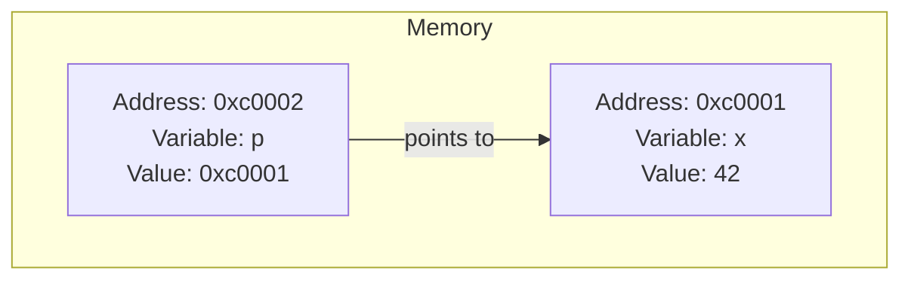

`p` doesn't hold `42` — it holds the *address* of the box that holds `42`. The arrow is the pointer.

---

## The Three Core Operators

| Syntax | Name | What it does |
|--------|------|--------------|
| `&x` | Address-of | Returns the memory address of `x` |
| `*int` | Pointer type | Declares a type: "pointer to int" |
| `*p` | Dereference | Reads or writes the value at the address `p` holds |

---

## Step-by-Step Basics

### Step 1 — Regular variable

```go
x := 42
fmt.Println(x) // 42
```

### Step 2 — Get an address with `&`

```go
x := 42
p := &x                   // p holds the address of x
fmt.Println(p)            // 0xc0000b4010 (some address)
fmt.Printf("%T\n", p)     // *int
```

### Step 3 — Dereference with `*`

```go
x := 42
p := &x
fmt.Println(*p) // 42  ← follows the address, reads the value
```

### Step 4 — Modify through a pointer

```go
x := 42
p := &x

*p = 100           // change the value AT the address
fmt.Println(x)     // 100 ← x is now changed!
```

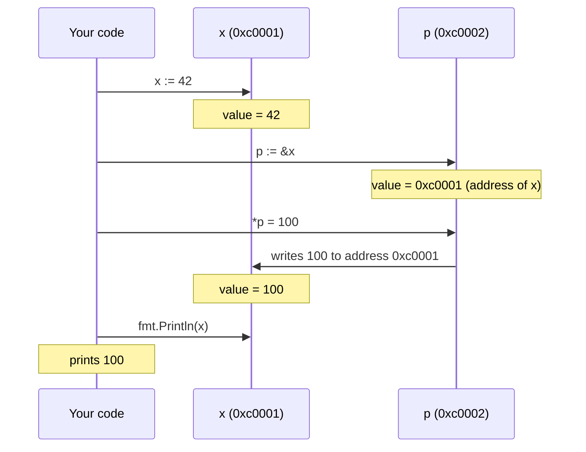

### Step 5 — Nil pointers

A pointer that points to nothing is `nil`. Dereferencing it will **panic**.

```go
var p *int
fmt.Println(p)   // <nil>
fmt.Println(*p)  // PANIC: runtime error: nil pointer dereference

// Always guard:
if p != nil {
    fmt.Println(*p)
}
```

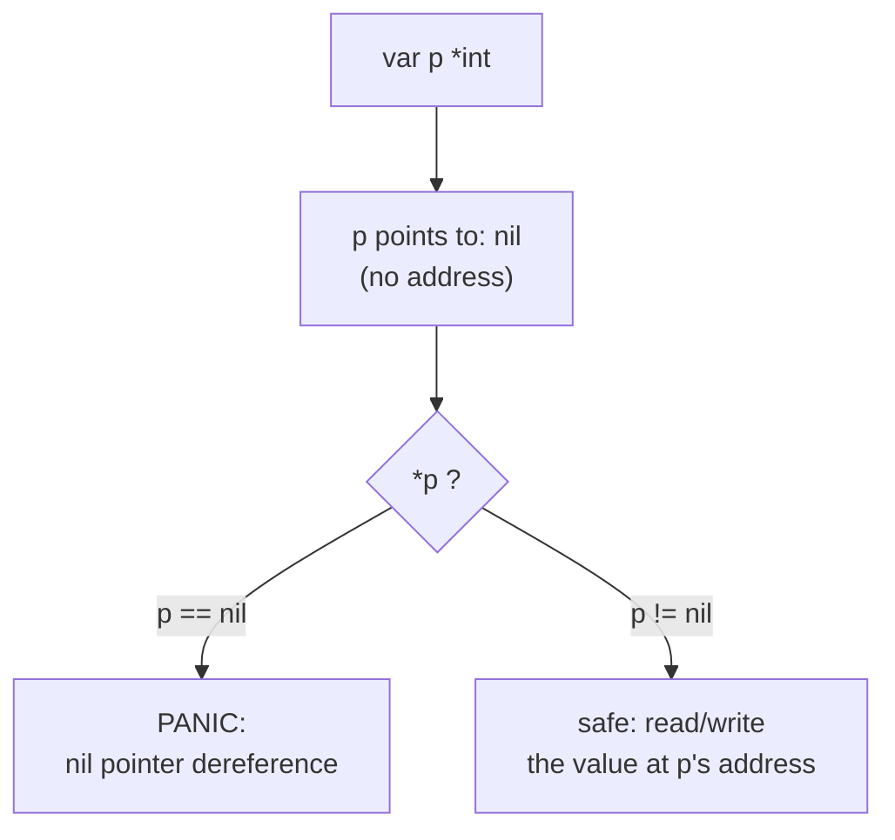

---

## Pointers with Functions

Without a pointer, Go passes a **copy** of the value. The original is not changed.

```go
func double(n int) {
    n = n * 2  // modifies the copy, not the original
}

x := 5
double(x)
fmt.Println(x) // still 5
```

With a pointer, the function can modify the **original**:

```go
func double(n *int) {
    *n = *n * 2  // modifies the value at the address
}

x := 5
double(&x)
fmt.Println(x) // 10 ✓
```

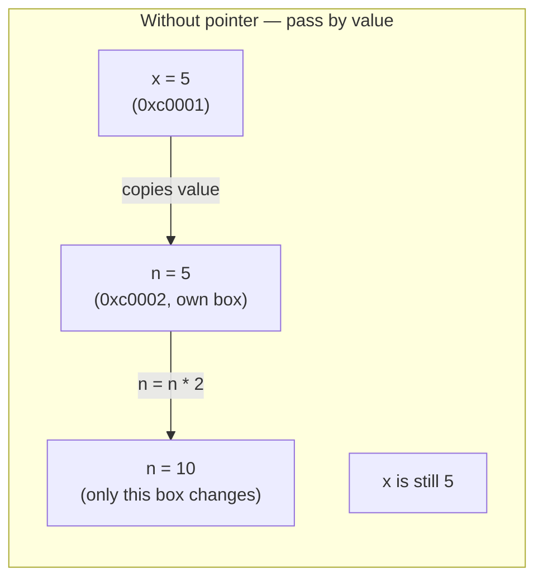

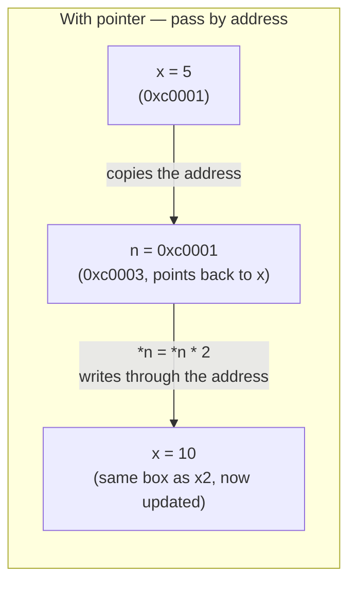

The key difference: passing a value copies the *data*. Passing a pointer copies the *address*, but both point back to the same original box — so writes through the pointer are visible to the caller.

---

## Pointers with Structs

```go
type Person struct {
    Name string
    Age  int
}

// Takes a COPY — original unchanged
func birthday(p Person) {
    p.Age++
}

// Takes a POINTER — modifies the original
func birthdayPointer(p *Person) {
    p.Age++ // shorthand for (*p).Age++ — Go auto-dereferences struct pointers
}

func main() {
    person := Person{Name: "Prathamesh", Age: 28}

    birthday(person)
    fmt.Println(person.Age) // 28 — unchanged

    birthdayPointer(&person)
    fmt.Println(person.Age) // 29 ✓
}
```

> **Note:** `p.Age++` inside a pointer function is Go's syntactic sugar for `(*p).Age++`. You don't need to write the `*` explicitly for struct fields.

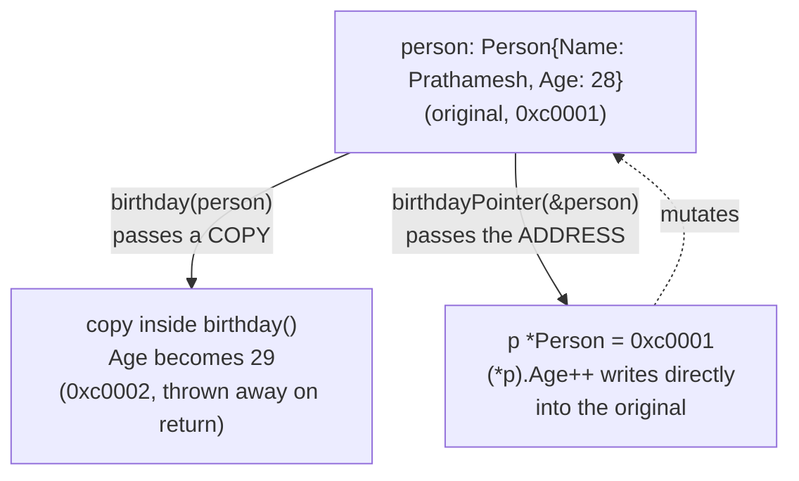

---

## `new()` vs `&T{}`

Two ways to create a heap-allocated pointer:

### `new(T)` — allocates and zeroes

```go
p := new(int)
fmt.Println(*p) // 0  ← zero value for int

p2 := new(Person)
fmt.Println(p2.Name) // ""
fmt.Println(p2.Age)  // 0
```

### `&T{}` — allocates and initialises (preferred for structs)

```go
person := &Person{Name: "Prathamesh", Age: 28}
fmt.Println(person.Name) // Prathamesh
```

> **Rule of thumb:** Use `new()` for primitives, `&T{}` for structs.

---

## Pointer Receivers on Methods

This is how Go handles object-oriented-style mutation.

```go
type Counter struct {
    count int
}

// Value receiver — gets a COPY, original unchanged
func (c Counter) IncWrong() {
    c.count++
}

// Pointer receiver — operates on the ORIGINAL
func (c *Counter) Inc() {
    c.count++
}

func (c *Counter) Value() int {
    return c.count
}

func main() {
    c := Counter{count: 0}

    c.IncWrong()
    fmt.Println(c.count) // 0 — unchanged

    c.Inc()
    c.Inc()
    fmt.Println(c.count) // 2 ✓
}
```

> **Rule of thumb:** If *any* method on a type needs to mutate state, use pointer receivers on *all* methods of that type for consistency.

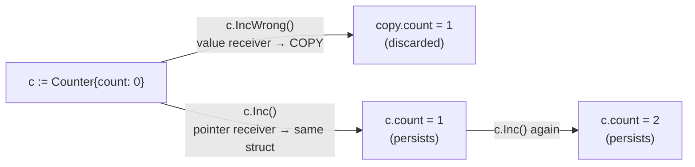

> Go automatically takes the address for you when you call a pointer-receiver method on an addressable value — that's why `c.Inc()` works even though `c` isn't `&c`.

---

## Stack vs Heap & Escape Analysis

Go manages memory automatically. You don't choose stack vs heap — the **compiler decides** using escape analysis.

| Location | Characteristics |
|----------|----------------|
| **Stack** | Fast, auto-freed when function returns |
| **Heap** | GC-managed, lives longer, slight overhead |

```go
// Value stays on the STACK — never leaves the function
func localOnly() {
    x := 42
    fmt.Println(x) // x is gone after this returns
}

// Value ESCAPES to the HEAP — pointer outlives the function
func newPerson() *Person {
    p := &Person{Name: "Prathamesh"} // heap-allocated
    return p                          // safe! still valid after return
}
```

### See escape analysis yourself

```bash
go build -gcflags="-m" main.go
# Example output:
# ./main.go:8:7: &Person{...} escapes to heap
```

> Go's garbage collector handles freeing heap memory. You don't need to `free()` anything like in C.

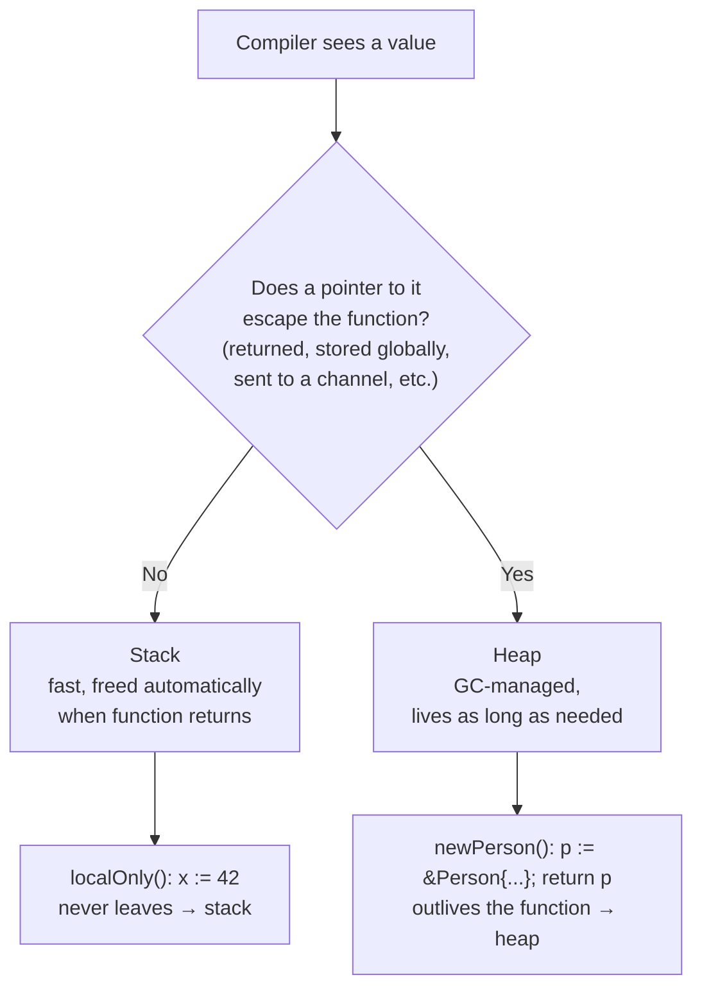

This decision is called **escape analysis**, and it happens entirely at compile time — you never write `stack` or `heap` in your code.

---

## Pointers with Slices and Maps

Slices and maps in Go are already **reference-like** — internally a slice is a small struct holding a pointer to an underlying array, a length, and a capacity. This is why you rarely need `*[]int` or `*map[string]int`.

```go
func appendOne(s []int) []int {
    return append(s, 99)
}

nums := []int{1, 2, 3}
nums = appendOne(nums) // must reassign — append may return a NEW underlying array
```

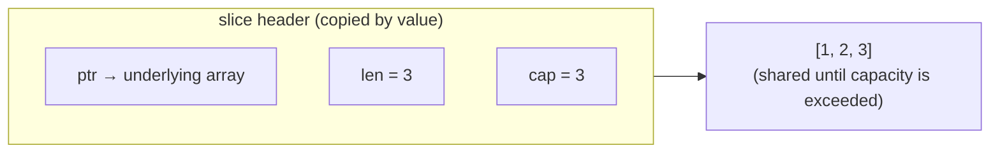

- Mutating an **existing element** (`s[0] = 100`) is visible to the caller — no pointer needed, because both copies of the slice header point at the same underlying array.
- **Appending past capacity** allocates a *new* underlying array — the caller's old slice header still points at the old array, which is why `append` must be reassigned.
- A pointer to a slice (`*[]int`) is only needed if you want a function to change the caller's length/cap/pointer itself (rare — e.g. a `reset()` helper).

Maps are always reference types too — passing a map to a function never needs a pointer to mutate its contents.

---

## Pointers to Pointers (`**T`)

Rare, but useful to recognise — a pointer can itself point to another pointer.

```go
x := 42
p := &x    // *int  — points to x
pp := &p   // **int — points to p, which points to x

fmt.Println(**pp) // 42 — dereference twice
```

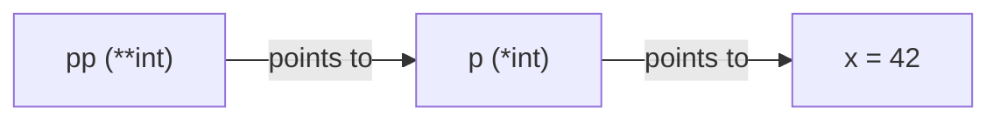

You'll mostly see `**T` when a function needs to reassign the caller's pointer itself (e.g. replacing what `p` points to, not just the value at `*p`) — uncommon in everyday Go code, but shows up in some C-interop and low-level library code.

---

## Common Mistakes

### ❌ Mistake 1: Loop variable pointer trap

```go
// WRONG — all pointers point to the same variable i
func badPointers() []*int {
    result := []*int{}
    for i := 0; i < 3; i++ {
        result = append(result, &i) // &i is always the same address!
    }
    // All three dereference to 3 (the final value of i)
    return result
}

// CORRECT — capture a copy each iteration
func goodPointers() []*int {
    result := []*int{}
    for i := 0; i < 3; i++ {
        v := i               // new variable, new address
        result = append(result, &v)
    }
    return result
}
```

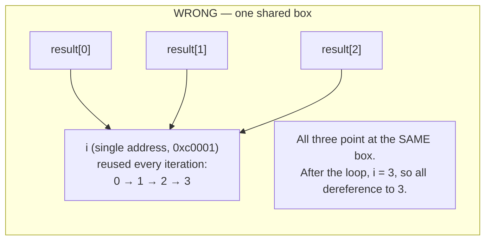

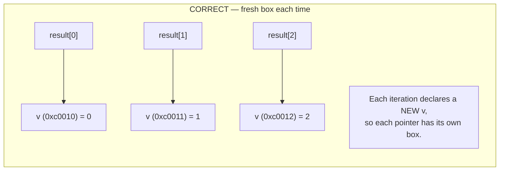

> **Note:** In Go 1.22+, loop variables are re-created each iteration, so this trap no longer applies for range loops. But it still applies for classic `for i := 0; ...` loops.

### ❌ Mistake 2: Nil pointer dereference

```go
// WRONG
func risky(p *int) {
    fmt.Println(*p) // PANIC if p is nil
}

// CORRECT
func safe(p *int) {
    if p == nil {
        fmt.Println("no value provided")
        return
    }
    fmt.Println(*p)
}
```

### ❌ Mistake 3: Over-using pointers for performance

```go
// Small structs — passing by value is often FASTER
// (pointer indirection causes cache misses)
type Point struct{ X, Y float64 }

func distanceByValue(p Point) float64 { ... }   // ✓ fine for small structs
func distanceByPointer(p *Point) float64 { ... } // unnecessary indirection

// Large structs — pointer is better
type BigConfig struct { /* 50+ fields */ }
func process(cfg *BigConfig) { ... } // ✓ avoids a big copy
```

---

## Full Cheat Sheet

```go
// --- Declarations ---
var p *int            // nil pointer to int
p := &x               // pointer to existing variable x
p := new(int)         // pointer to new zeroed int on heap
p := &Person{Age: 28} // pointer to new initialised struct on heap

// --- Reading & Writing ---
*p                    // dereference: get the value
*p = 42               // dereference: set the value
p.Name                // shorthand for (*p).Name on structs

// --- Checking ---
p == nil              // true if pointer is unset
p != nil              // safe to dereference

// --- Function signatures ---
func read(p *int) int { return *p }        // read via pointer
func mutate(p *int)   { *p = 99 }         // mutate via pointer
func (c *Counter) Inc() { c.count++ }     // pointer receiver method

// --- Printing ---
fmt.Println(p)        // prints the address: 0xc000...
fmt.Println(*p)       // prints the value at that address
```

---

## When to Use Pointers

| Use a pointer when... | Use a value when... |
|-----------------------|---------------------|
| You need to mutate the original | You only need to read |
| The struct is large (many fields) | The struct is small (2–3 fields) |
| You want to express "optional" (`nil`) | The value is always present |
| Implementing interface methods that mutate | Pure functions / computations |

---

## Quick Mental Model

```
&  →  "take me TO the address"     (variable → address)
*  →  "follow the address BACK"    (address → value)

They are opposites.
```

---

## Practice Exercises

Try these before moving on — they cover the traps above:

1. Write a `func swap(a, b *int)` that swaps the values at two addresses. Call it on two variables and confirm they swapped.
2. Write a `Stack` struct backed by a `[]int` with pointer-receiver methods `Push(v int)` and `Pop() (int, bool)`. Why must the receiver be a pointer here?
3. Predict the output, then run it and check yourself:
   ```go
   type Box struct{ Value int }
   func change(b Box)   { b.Value = 99 }
   func changeP(b *Box) { b.Value = 99 }

   box := Box{Value: 1}
   change(box)
   fmt.Println(box.Value)  // ?
   changeP(&box)
   fmt.Println(box.Value)  // ?
   ```
4. Run `go build -gcflags="-m"` on a small file with both a stack-only and a heap-escaping function. Confirm which lines the compiler reports as "escapes to heap".

---

## Related Topics to Explore Next

- [x] Pointers inside slices and maps
- [x] Pointers to pointers (`**T`)
- [ ] Interfaces with pointer types
- [ ] Concurrency and pointer safety (`sync.Mutex`)
- [ ] Unsafe pointers (`unsafe.Pointer`) — advanced
- [ ] Go garbage collector internals
