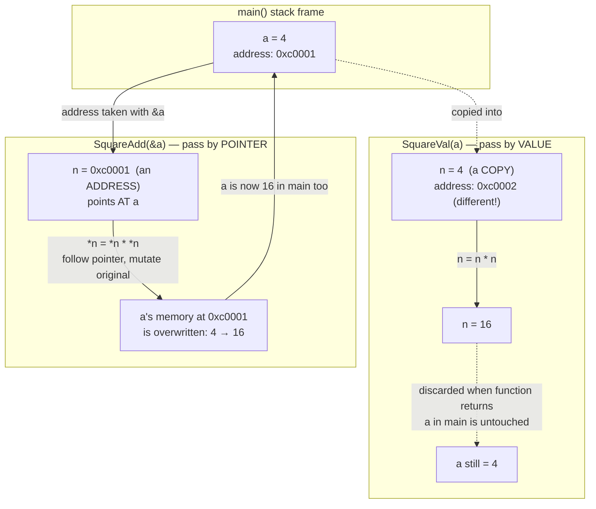
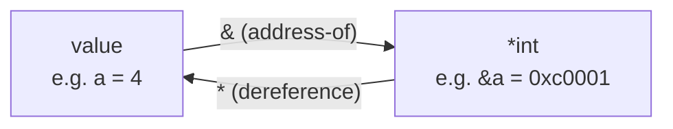

# NOTES

## pointers.go — 2026-09-18

**Q: Check this file and explain pointers, with diagrams for understanding the concepts in depth.**

This file contrasts two ways of passing `a` into a function: by value (`SquareVal`) and by pointer (`SquareAdd`).

```go
func SquareVal(n int) int {
	return n * n
}

func SquareAdd(n *int) int {
	*n = *n * *n
	updatedVal := *n
	return updatedVal
}
```

- `SquareVal(a)` — `a` is *copied* into `n`. Squaring `n` inside the function has zero effect on `a` in `main`. That's why the notes print "Squared value of a before mutating" separately — `a` itself is untouched even after the call.
- `SquareAdd(&a)` — `&a` takes the **address** of `a` and passes it as a `*int` (pointer to int). Inside the function, `*n` *dereferences* the pointer — "go to the address `n` holds, and read/write the value there." So `*n = *n * *n` mutates `a` directly, in place, in `main`'s own memory — no copy involved.
- The `fmt.Println("Address of a:", &a)` calls before and after `SquareAdd` print the *same* address both times — proving pointers don't move the variable, they just let another function reach into it.

### Value vs. pointer semantics (memory diagram)



### `&` vs `*` cheat sheet



- `&a` — "give me the **address** where `a` lives" → produces a `*int`.
- `*n` (where `n` is `*int`) — "go **to** that address and give me the value stored there" → produces an `int`.
- `*n = x` — "go to that address and **overwrite** the value stored there."

### ASCII view of what happens in `SquareAdd(&a)`

```
main()                          SquareAdd(n *int)
+------------------+            +------------------+
| a: 4             |  &a  --->  | n: 0xc0001        |  (n stores an address)
| addr: 0xc0001    |            +------------------+
+------------------+                     |
                                          | *n  (dereference: follow the arrow)
                                          v
                                +------------------+
                                | a: 4 -> 16        |  <-- mutated directly
                                | addr: 0xc0001     |      (same memory as main's a)
                                +------------------+
```

**Q: Why do both address prints show the same value?**
Because `&a` always refers to the one storage location Go allocated for `a` in `main`'s stack frame. `SquareAdd` receives that address (not a copy of `a`), does its mutation through the pointer, and returns — `a`'s address never changes, only its *contents* (4 → 16) do. That's the whole point of using a pointer: you get to reach into the caller's variable instead of working on a throwaway copy.
