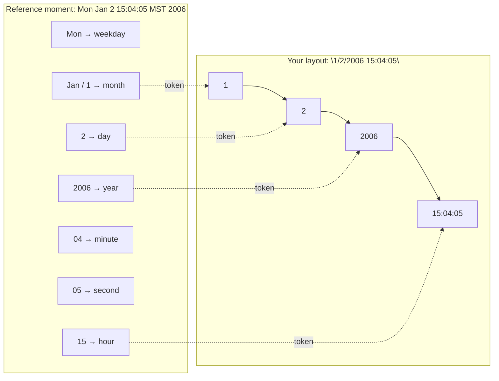
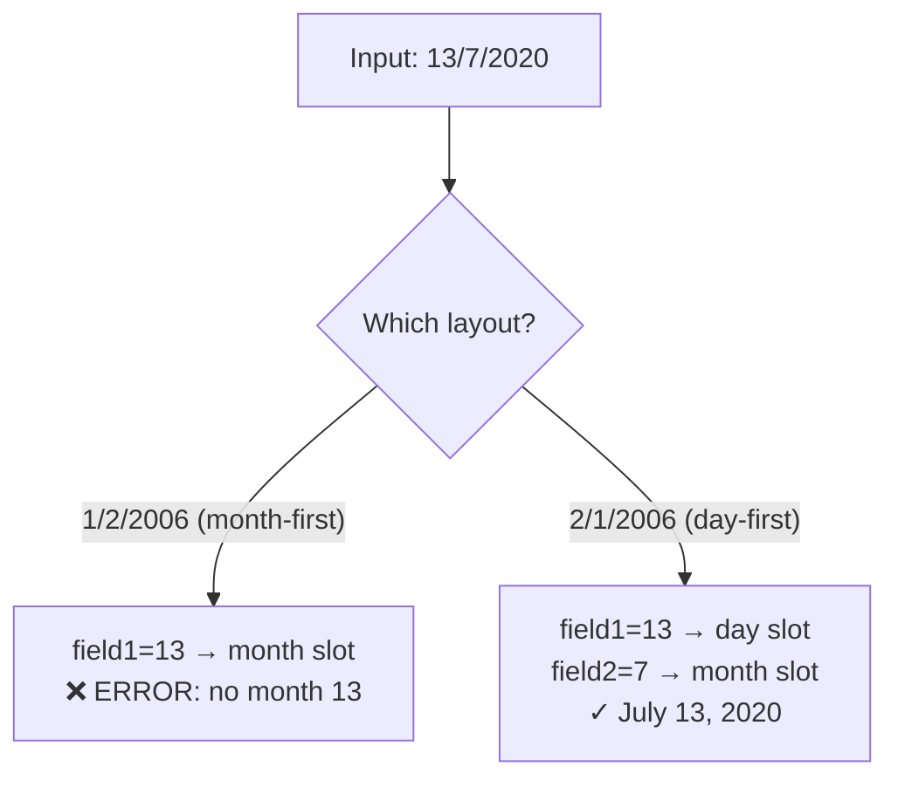
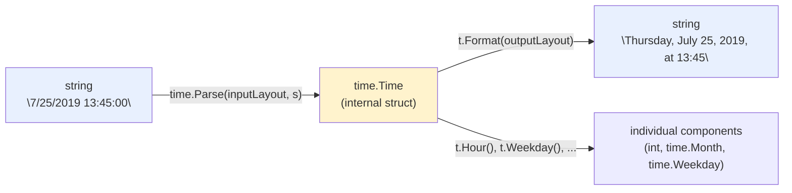
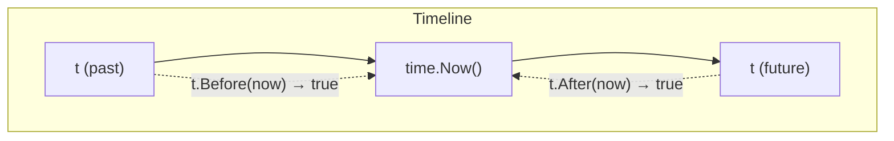

# Go Time Formatting — Complete Guide

> **Tags:** #go #backend #time #learning
> **Status:** #reference
> **Related:** [[Go Basics]] [[Go Pointers|Understanding Go Pointers]]

---

## The Core Idea: The Reference Date

Go doesn't use format specifiers like `%Y-%m-%d` (Python/C) or tokens like
`YYYY-MM-DD` (JS libraries). Instead, `time.Parse` and `time.Format` both
work off **one fixed, memorable reference moment**:

```
Mon Jan 2 15:04:05 MST 2006
```

Every layout token is just "whatever that component equals in this
reference moment" — nothing more:

| Component        | Value in reference moment | Token(s) you write |
|-------------------|---------------------------|----------------------|
| Year              | 2006                      | `2006` (full) / `06` (2-digit) |
| Month             | January (1st month)       | `1` / `01` (numeric), `Jan` / `January` (name) |
| Day               | 2nd                       | `2` / `02` |
| Weekday           | Monday                    | `Mon` / `Monday` |
| Hour (24h)        | 15                        | `15` |
| Hour (12h)        | 3                         | `3` / `03` (+ `PM`) |
| Minute            | 04                        | `04` |
| Second            | 05                        | `05` |
| Timezone name     | MST                       | `MST` |
| Timezone offset   | -0700                     | `-0700` / `Z07:00` |

A layout is built by writing this reference date's tokens **in the exact
order and punctuation you want your real value's fields to appear**. Any
character in the layout that ISN'T one of these recognized tokens is
treated as **literal text** that must match exactly.

```go
layout := "1/2/2006 15:04:05" // month/day/year hour:minute:second
```



---

## Why Order (Not Magnitude) Decides Month vs. Day

This is the single most common source of confusion: it is **not** "smaller
number = month, bigger number = day." It is purely positional, tied to
where `1` (month) and `2` (day) happen to fall in the reference date.

```go
time.Parse("1/2/2006", "7/13/2020")  // 1st slot=month(7), 2nd slot=day(13) ✓
time.Parse("2/1/2006", "13/7/2020")  // 1st slot=day(13), 2nd slot=month(7) ✓
time.Parse("1/2/2006", "14/02/2008") // 1st slot=month(14) → ERROR: invalid month
```

Go never inspects the actual digits and reasons "14 can't be a month, let
me try it as a day instead." If your layout says month-first, whatever
value is in that slot gets forced into the month field — errors if invalid,
silently wrong if it happens to also be a valid month/day combo the other
way around (e.g. `03/04/2026` is genuinely ambiguous — only you, the
programmer, know from the data source whether it's March 4 or April 3).

**Rule of thumb:** you must already know your input's field order from
context (the data source's locale/convention) and build the layout to
match it — Go supplies zero inference here.



---

## Common Mistake: Copying an Example Instead of the Reference Date

```go
// WRONG — this is a real example date, not the reference date
time.Parse("Thursday, July 25, 2019 13:45:00", date)
// error: cannot parse "..." — none of these substrings are recognized tokens

// RIGHT — built from Mon Jan 2 15:04:05 MST 2006
time.Parse("Monday, January 2, 2006 15:04:05", date)
```

Only `Monday`, `January`, `2`, `2006`, `15:04:05` (and their variants) are
"magic." Everything else in a layout — including something that merely
*resembles* your real data — is literal text Go tries to match
character-for-character.

---

## Parsing: string → time.Time

```go
t, err := time.Parse(layout, value)
if err != nil {
    // always check — malformed input is common
}
```

- `layout` describes the **shape of the input string**.
- Returns `time.Time` in **UTC by default** if no timezone appears in the
  layout/input.

## Formatting: time.Time → string

```go
s := t.Format(layout)
```

- Same token language, reverse direction.
- `layout` here describes the **shape you want the output string to have**.
- **A `Parse` layout and a `Format` layout in the same function are often
  different strings** — one matches the input shape, the other the desired
  output shape. Don't reuse one layout string for both jobs unless the
  shapes genuinely match.



## Constructing from scratch: time.Date

When you're not parsing a string at all, but building a `time.Time` from
known/computed components:

```go
t := time.Date(year, month, day, hour, min, sec, nsec, loc)
// month must be a time.Month constant, e.g. time.September (not a raw int)
// loc is a *time.Location, e.g. time.UTC
```

Example — "September 15 of the current year, midnight UTC":

```go
year := time.Now().Year()
t := time.Date(year, time.September, 15, 0, 0, 0, 0, time.UTC)
```

---

## Accessor Methods on `time.Time`

Once you have a `time.Time` (from `Parse`, `Date`, or `Now`), pull fields
back out with methods — no manual string-slicing needed:

```go
t.Year()    // int
t.Month()   // time.Month (named type, prints as "July")
t.Day()     // int
t.Weekday() // time.Weekday (named type, prints as "Thursday") — COMPUTED
             // from the date, not extracted from the string; a string
             // like "7/25/2019" contains no weekday text at all.
t.Hour()    // int, 24h (0-23)
t.Minute()  // int
t.Second()  // int
```

---

## Comparing Times

Never use `==`, `<`, `>` on `time.Time` directly (structs can carry a
monotonic clock reading that makes naive comparison unreliable). Use the
dedicated methods instead:

```go
now := time.Now()

t.Before(now)  // true if t is in the past
t.After(now)   // true if t is in the future
t.Equal(now)   // true if exactly equal (instant-based, timezone-agnostic)

elapsed := time.Since(t) // shorthand for time.Now().Sub(t); time.Duration
elapsed > 0              // true if t is in the past
```

`Before`/`After`/`Equal`/`Sub` all compare the **absolute instant**, so
mismatched timezones between the two values don't break correctness — only
readability.



---

## Default String() Output

Printing a `time.Time` directly (`fmt.Println(t)`) uses its built-in
`String()` method, with layout:

```
2006-01-02 15:04:05.999999999 -0700 MST
```

So a UTC time with zero nanoseconds prints like:
`2019-07-25 13:45:00 +0000 UTC` — no explicit `.Format()` call needed if
this default shape is all you want.

---

## No String Interpolation — Use Format or Sprintf

Go has no JS-style template literals (`` `${x}` ``). Backticks in Go are
raw string literals (no escaping, no interpolation) — unrelated concept.

For turning a `time.Time` into a string, prefer `t.Format(layout)` — it's
the purpose-built tool and needs no manual piecing-together.

For general value interpolation into strings (non-time use cases):

```go
fmt.Sprintf("%s is %d", name, age) // returns a string (the "S" prefix
                                     // means "return as String" — unlike
                                     // Printf, which writes to stdout)
```

---

## Quick Reference Card

```go
"2006"            // year (4-digit)
"06"              // year (2-digit)
"1" / "01"        // month (numeric)
"Jan" / "January" // month (name)
"2" / "02"        // day
"Mon" / "Monday"  // weekday
"15"              // hour (24h)
"3" / "03" + "PM" // hour (12h)
"04"              // minute
"05"              // second
"MST"             // timezone name
"-0700"           // timezone offset
"Z07:00"          // ISO-style offset (Z for UTC)
```

## Related Concepts
- [[Understanding Go Pointers]]
- Go structs (time.Time is a struct under the hood)
- Named types (time.Month, time.Weekday) vs. plain int/string
