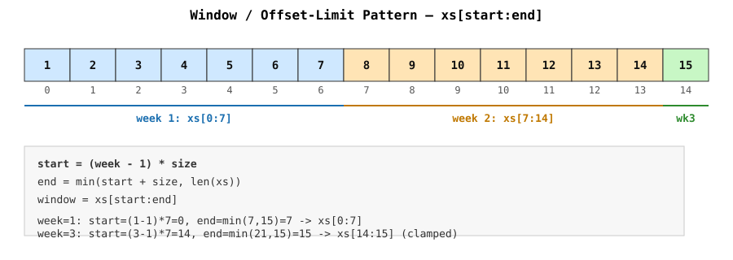

# Window / Offset-Limit Pattern

How to grab "the Nth chunk of size K" out of a slice — the same arithmetic
that powers pagination (`OFFSET`/`LIMIT`), "week N" style splits, fixed-size
sliding windows, and batch processing.

## The problem

Given a slice and a "unit number" (week 1, page 2, chunk 3, ...), find the
sub-slice that belongs to that unit.

```go
xs := []int{1,2,3,4,5,6,7,8,9,10,11,12,13,14,15}
// week 1 -> {1..7}
// week 2 -> {8..14}
// week 3 -> {15}      (partial — only 1 item left)
```

## The formula

```
start = (n - 1) * size
end   = min(start + size, len(xs))
window = xs[start:end]
```

Two things happen here, and they're the two things worth internalizing:

1. **`(n - 1) * size` — translate "which unit" into "which index".**
   Humans count units from 1 (week 1, page 1). Arrays count from 0. The
   `-1` is the conversion between those two counting systems. Get this
   backwards and week 1 starts at index 7 instead of 0 — the single most
   common bug in this pattern.

2. **`min(start + size, len(xs))` — clamp the end.**
   Data rarely divides evenly into your window size. Without clamping,
   slicing past `len(xs)` panics (`slice bounds out of range`). The `min`
   says "give me the window, or whatever's left if the window runs off
   the end."

## Diagram



ASCII version, if the image doesn't render:

```
index:   0   1   2   3   4   5   6   7   8   9  10  11  12  13  14
value:   1   2   3   4   5   6   7   8   9  10  11  12  13  14  15
        |------- week 1 --------|-------- week 2 --------|--w3--|
        ^ start=0                ^ start=7                ^ start=14
        size=7 -> end=7          size=7 -> end=14          end=min(21,15)=15

week N=1: xs[0:7]    -> {1,2,3,4,5,6,7}
week N=2: xs[7:14]   -> {8,9,10,11,12,13,14}
week N=3: xs[14:15]  -> {15}              <- clamped, would've been xs[14:21]
```

## Go code

See [`window.go`](./window.go) for a runnable version:

```go
func weekSlice(xs []int, week int) []int {
    const size = 7
    start := (week - 1) * size
    if start > len(xs) {
        start = len(xs)
    }
    end := min(start+size, len(xs))
    return xs[start:end]
}
```

Or computed inline, without a helper:

```go
chunk := xs[(week-1)*7 : min((week-1)*7+7, len(xs))]
```

## Where else this shows up

The same `start`/`end` shape appears under different names — recognizing it
saves re-deriving it every time:

| Domain                     | "unit"        | formula                                  |
|-----------------------------|---------------|-------------------------------------------|
| Pagination (REST API)       | page number   | `offset = (page-1) * pageSize`             |
| SQL                          | page number   | `LIMIT pageSize OFFSET (page-1)*pageSize`  |
| "week N" / "day N" splits    | week/day      | `start = (n-1) * unitSize`                 |
| Batch processing             | batch number  | same as above, often looped:               |
| Fixed-size sliding window    | window pos    | `start`, `end` both *increment* by 1 each step instead of jumping by `size` |

Batch loop version (process *all* chunks, not just one):

```go
for start := 0; start < len(xs); start += size {
    end := min(start+size, len(xs))
    chunk := xs[start:end]
    process(chunk)
}
```

## Mental checklist for spotting this pattern

When a problem says "the Nth group of size K", don't reach for the data
first — reach for the index arithmetic:

1. What's my unit/window size?
2. What index does unit N start at? (`(n-1) * size`, mind the indexing base)
3. What index does it end at? (`start + size`)
4. Could that end run past my data? (clamp with `min`)

Once `start`/`end` are correct, slicing, summing, or iterating the chunk is
trivial — the arithmetic is the actual problem.

## Gotcha: slices share memory

`xs[start:end]` does **not** copy data — it shares the underlying array with
`xs`. Mutating the returned chunk can mutate `xs` too. If you need an
independent copy:

```go
chunkCopy := slices.Clone(xs[start:end]) // Go 1.21+, "slices" package
```
